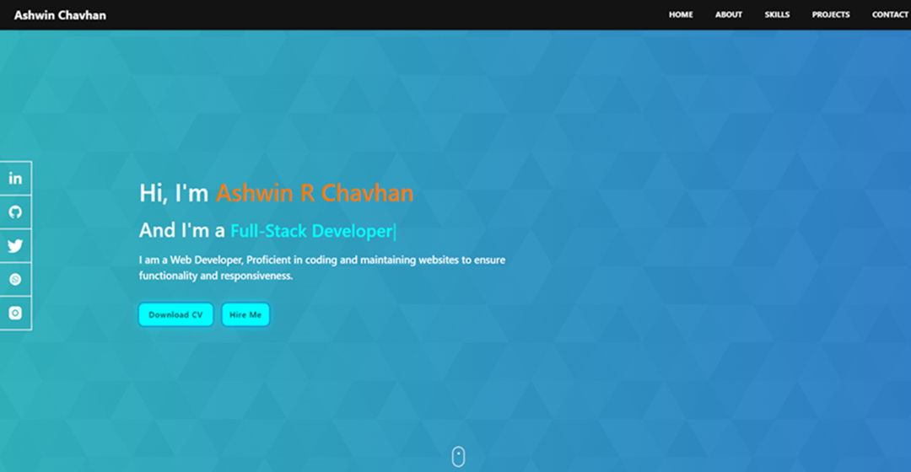

 # Portfolio Website

Welcome to my personal portfolio website! This site showcases my skills, projects, and achievements in web development. It was built using HTML, CSS, JavaScript, Bootstrap, and Node.js.

## Demo

You can view the live version of the portfolio website here:  
[Visit My Portfolio](https://portfolio-website-io.netlify.app/)

## Screenshot

Here's a preview of my portfolio:



## Features

- **Responsive design**: Optimized for both desktop and mobile views.
- **Interactive elements**: Built with JavaScript for interactive user experience.
- **Modern UI**: Clean and minimalist design using Bootstrap for responsive components.
- **Node.js Backend**: If your portfolio includes any server-side functionality, this will be powered by Node.js.
- **Frontend hosted on Netlify**: Fast, reliable deployment with automatic continuous deployment.
- **Backend hosted on Render**: Scalable backend environment for API handling and dynamic content.

## Technologies Used

- **HTML5**: Used for structuring the content of the website.
- **CSS3**: For styling the website and ensuring a responsive layout.
- **JavaScript**: Added interactivity to the portfolio, such as animations and form handling.
- **Bootstrap5**: For easy and responsive layout components.
- **Node.js**: Server-side functionality, including API or dynamic content generation.
- **Netlify**: Front-end deployment for a seamless, fast user experience.
- **Render**: Backend hosting and API services.

## Installation

If you want to run the portfolio locally, follow these steps:

1. Clone the repository to your local machine:
    ```bash
    git clone https://github.com/Ashwin-Chavhan/Portfolio-Website.git
    ```

2. Navigate to the project directory:
    ```bash
    cd Portfolio-Website
    ```

3. (If your portfolio uses Node.js backend):
    - Install dependencies using npm:
      ```bash
      npm install
      ```

4. Run the website locally:
    ```bash
    npm start
    ```

    Visit `http://localhost:3000` in your browser to see the website.

## Usage

- Browse through the homepage to see information about my projects and skills.
- You can view individual project details by clicking on the respective links.
- If you want to contact me, visit the contact page and fill out the form.

## Contributing

If you'd like to contribute to this project, feel free to fork the repository, create a branch, and submit a pull request. Make sure to include clear commit messages and explain any changes made.

## License

This project is licensed under the MIT License - see the [LICENSE](LICENSE) file for details.

## Acknowledgments

Special thanks to the developers and resources that helped me build this project:
- [Bootstrap](https://getbootstrap.com/) for responsive design.
- [Font Awesome](https://fontawesome.com/) for icons.
- [Node.js](https://nodejs.org/en/) for backend functionality.
- [Netlify](https://www.netlify.com/) for front-end deployment.
- [Render](https://render.com/) for back-end hosting.

---

Thanks for checking out my portfolio website! Feel free to reach out to me if you have any questions or feedback.
